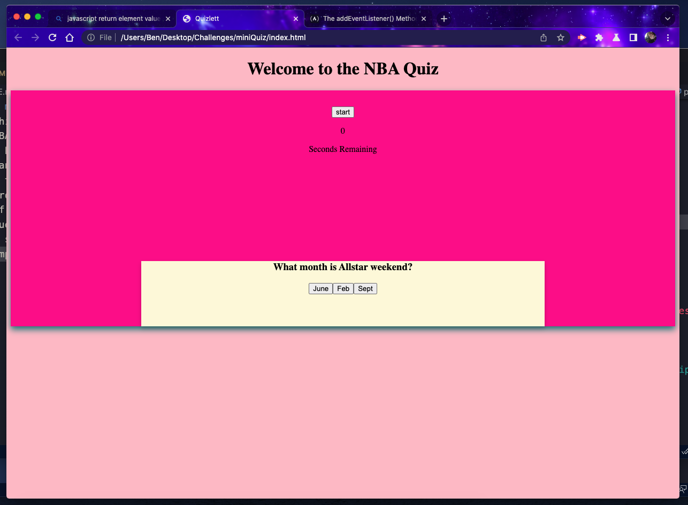

# miniQuiz
This project is my attempt at creating a small quiz on 90's NBA knowledge.
I have made a button activated quiz that keeps score of how many questions you got right. 
I tried to make each question rotate through and have provided an alert when you answer, so you know if you got it right.
If you get the answer correct it will move you to the next question.
I styled my page with my favorite colors and tryied to impliment the things I have learned.
I have a set timer that counts down until you complete the quiz.
I was not able to add the score or tie it to the local storage.
I had alot of help from Will, Henery, and a tutor.

readme.md

https://mfarrell23.github.io/miniQuiz/